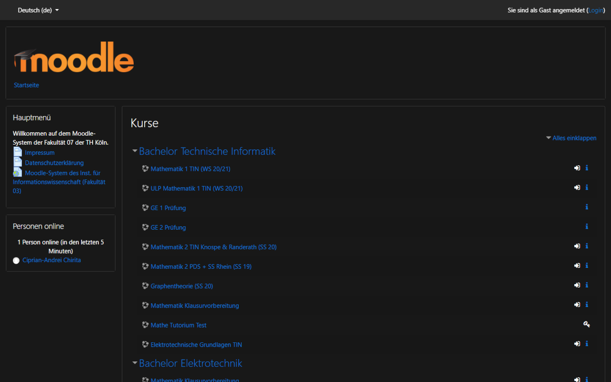

# Darkmode für BUW Moodle.
Diese Extension erweitertet Moodle von BUW (Bergische Universität Wuppertal) um einen Darkmode.

## Download

[Firefox Addon](https://addons.mozilla.org/de/firefox/addon/darkmode-f%C3%BCr-buw-moodle/)
[Chrome Extension](https://chrome.google.com/webstore/detail/darkmode-f%C3%BCr-buw-moodle/kipahojjgbnhnjjfpamggpealcdaalfp?hl=de)

## Screnhots

